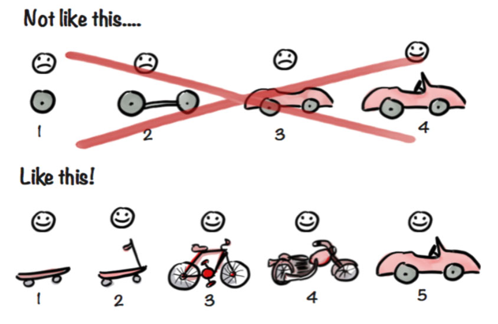
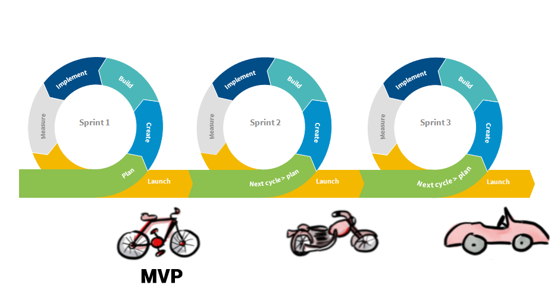

[:arrow_backward:](../README.md)

Ce Bristol permet de dégrossir ce vaste sujet qu'est la méthodologie de projet.

# Sommaire

- [La méthodo](#la-methodo)
- [Les approches](#les-approches)
  - [Approche séquentielle](#approche-séquentielle)
  - [Approche agile](#approche-agile)
  - [Quelques différences](#quelques-différences)
- [Outils](#outils)
- [Ressources utiles](#ressources-utiles)

## La méthodo

La méthodologie de projet va consister en la mise en place de "process" et l'utilisation d'outils, qui vont permettre le bon déroulement de celui-ci.

Cela aura un impact notamment sur plusieurs aspects du projet:

- *Communication*: Mise en place de « process » qui vont permettre de valider la compréhension avant la réalisation.
- *Planification*: Permet d'avancer sereinement sans avoir à se soucier de définir la prochaine étape.
- *Coordination*: Mise en place d'outils permettant à l'équipe de mieux travailler ensemble.

Il existe deux grandes approches, *séquentielle* et *agile* donnant naissances à plusieurs méthodologies de projet.

## Les approches

La différence principale entre les approches *séquentielle* et *agiles* se situe au niveau de la définition du projet. L'approche *séquentielle* considère la définition d'un produit fini quand l'approche *agile* cherche à s'adapter à des besoins changeants.

## Approche séquentielle

Les projets en approche séquentielle peuvent se décomposer en quatre grandes phases réalisé dans cet ordre:

### Définition du projet

Durant cette phase, l'équipe rédige les spécifications fonctionnelles qui détaillent les comportements de l'application de façon compréhensible pour tous les intervenants.

### Conception de l'architecture

Cette phase va permettre de rédiger les spécifications techniques qui regroupent des informations sur les technologies choisies, des diagrammes UML et autre support aidant à la réalisation du projet.

### Réalisation

C'est au tour des développeurs de réaliser l'application à l'aide des documents précédents.

### Recettage

Cette phase va permettre de vérifier que l'application fonctionne bien comme spécifié lors de la définition du projet.

## Approche agile

L'approche agile cherche à s'adapter aux besoins changeants des clients dans un monde qui évolue très vite. Pour y arriver, elle adopte une approche itératif et incrémental résumé par cette image:

Plutôt que d'essayer de réaliser un produit rêvé en une étape, l'agilité préconise de commencer par un produit minimum viable (MVP) qu'on fera évoluer dans le temps. Cette approche permet de limiter les risques, de s'adapter au marché et de faire évoluer son idée en la concrétisant.

### Quelques différences

Ci-dessous, une liste de différences entre ces approches*:

<table>
  <thead>
      <tr>
          <th></th>
          <th>Approche séquentielle</th>
          <th>Approche agile</th>
      </tr>
  </thead>
    <tbody>
        <tr>
            <td>Cycle de vie</td>
            <td>Défini et strict </td>
            <td>Itératif et incrémental</td>
        </tr>
        <tr>
            <td>Spécifications</td>
            <td>Exhaustives, lors des phases de conception</td>
            <td>Outils de communication permet la réalisation du cycle courant</td>
        </tr>
        <tr>
            <td>Équipe</td>
            <td>Sous la direction d'un.e chef.fe de projet</td>
            <td>Responsabilisée par des process avec forte exigence de communication</td>
        </tr>
        <tr>
            <td>Suivi</td>
            <td>Analyse des écarts avec le cahier des charges</td>
            <td>Priorisation et gestion des risques</td>
        </tr>
        <tr>
            <td>Mesure du succès</td>
            <td>Respect du cahier des charges</td>
            <td>Satisfaction client</td>
        </tr>
    </tbody>
</table>

## Outils

Que vous ayez une approche agile ou séquentielle, il est important d'avoir une palette d'outils permettant à la bonne communication autour de votre projet, en voici quelques uns:

...

## Ressources utiles

[Le manifeste agile](https://agilemanifesto.org/iso/fr/manifesto.html)

[Le guide SCRUM](https://scrumguides.org/docs/scrumguide/v2017/2017-Scrum-Guide-French.pdf) qui est la méthode agile la plus populaire.

[Liste de pratiques agiles](http://referentiel.institut-agile.fr/index_alpha.html)

